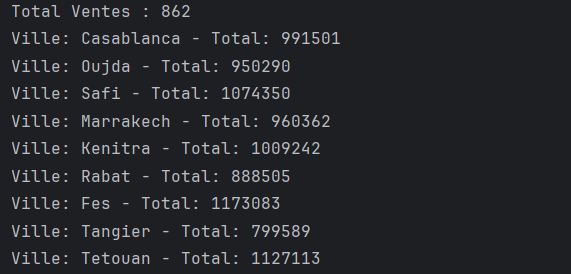
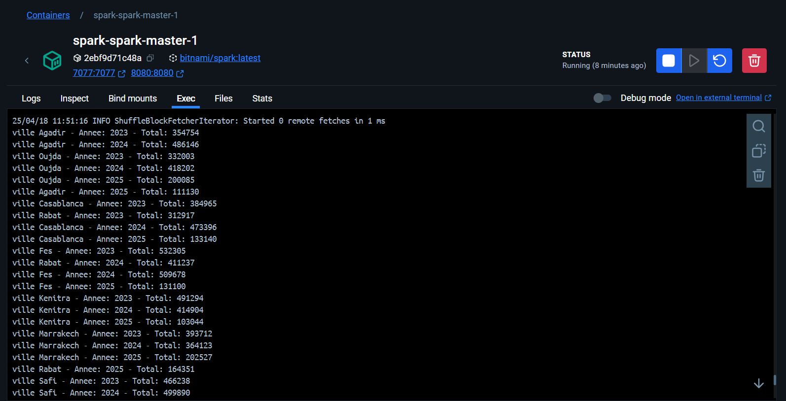

#   Spark — git init


## 📌 Enoncé
Ce TP a pour objectif de manipuler **Apache Spark** afin de réaliser un traitement parallèle et distribué sur un fichier de ventes.  
On cherche à développer deux applications Spark en **Java** :

1. **Exercice 1 :**
   - À partir d’un fichier texte `ventes.txt`, contenant les ventes d’une entreprise dans différentes villes, déterminer le **total des ventes par ville**.
   - La structure du fichier `ventes.txt` est la suivante :
     ```
     date ville produit prix
     ```
     Exemple :
     ```
     27/01/2025 Tangier AsusZenBook 5950
     10/02/2024 Tangier HPEnvy 6126
     ```

2. **Exercice 2 :**
   - Créer une deuxième application permettant de calculer le **prix total des ventes par ville et par année**.

---
## 💡  Technologies utilisées

- **Java 8**
- **Apache Spark 3.3+**
- **Maven**
- **Docker & Docker Compose**
- **Bitnami Spark Docker image**

---
## 📂 Structure du projet
```
TP_Spark/
├── src/
│   └── main/java/Main.java
├── ventes.txt
├── pom.xml
└── target/TP_Spark-1.0-SNAPSHOT.jar
```

---


## 🚀 Exécution locale (test)

📸 Exercice 1 :



---

##  Exécution sur un cluster Spark  Docker

### 🔧 1. Arborescence recommandée

```
spark-cluster/
├── docker-compose.yml
└── app/
    ├── TP_Spark-1.0-SNAPSHOT.jar
    └── ventes.txt
```

### ▶️ 2. Lancer le cluster

```bash
docker-compose up -d
```

👀 Interface Spark : [http://localhost:8080](http://localhost:8080)

---

### 📤 3. Exécuter l'application

```bash
spark-submit --class Main --master spark://spark-master:7077 /app/TP_Spark-1.0-SNAPSHOT.jar

```

---

## 📸 Résultats dans le cluster Spark

📌 le prix total des ventes des produits par ville et par année.

**Exécution visible dans Docker Desktop > spark-master > Exec :**


 

---
## 📌 Auteur
Hamza Rabih – TP Big Data- Spark -Master 1 II-BDCC – ENSET